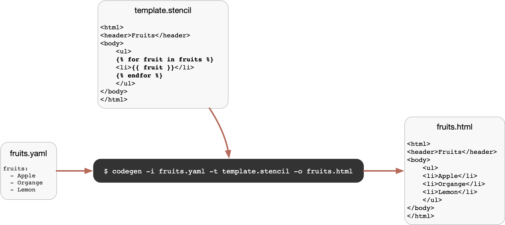
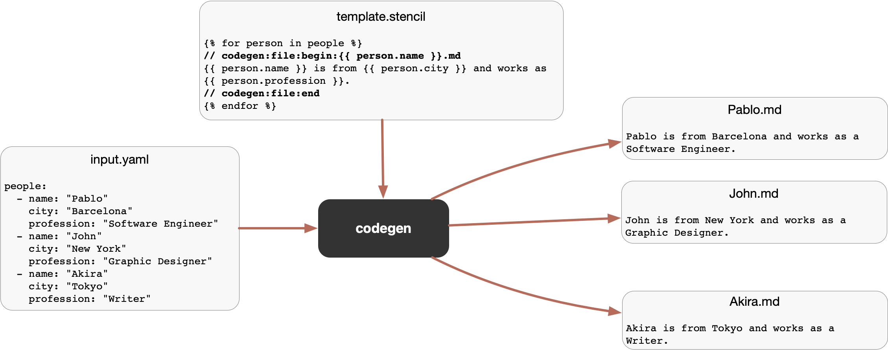

# Codegen

This is simple code generator that uses Stencil as template language and as input you can provide a context using a YAML, JSON or PLIST file.

Codegen is helpful for the cases that you have to autogenerate code, but as input, you can't use your source code. For instance, you can have a YAML with a list of feature flags and from there, autogenerate all the related boilerplate code. Check [Word of the Day](Examples/WordOfTheDay/README.md) example to learn more about that.

If you can use your source code as input to autogenerate the code, you should try [Sourcery](https://github.com/krzysztofzablocki/Sourcery).

Stencil is a simple and powerful template language for Swift, you can find more information [here](https://stencil.fuller.li).

Codegen also uses [StencilSwiftKit](https://github.com/SwiftGen/StencilSwiftKit), that library adds more Tags and Filters to Stencil.

## Installation

* Building with Swift Package Manager:

You can clone the project and then run:

```
$ swift build -c release
$ cd .build/release
$ cp -f codegen /usr/local/bin/codegen
```

Alternatively, you can run `$ sh install.sh` from the root folder.

* Homebrew

🚧coming soon 🚧


## Usage



Codegen is a command line tool. You have to provide three parameters: 

* `--input` or `-i` A path to the file input.
* `--template` or `-t` A path to the stencil template.
* `--output` or `-o` A path for the autogenerated codoe.

`$ codegen -i fruits.yaml -t template.stencil -o fruits.html`

As input you can provide a YAML, JSON or PLIST file, the extension is used to know how to parse the file.

Alternatively, instead of a file, you can provide as input a dictionary.

`$ codegen -i '{"fruits": ["Apple", "Organge", "Lemon"]}' -t template.stencil -o fruits.html`

By default, existing autogenerated files are not overriden. If you you want to override files everytime that you run codegen, include `--override` flag.

## File annotations

In case that you want to generate multiple files from one template or just set a custom name for the autogenerated file based on the input, you can use file annotations.

Imagine that you have an input YAML of people:



Having this input.yaml

```yaml
people:
  - name: "Pablo"
    city: "Barcelona"
    profession: "Software Engineer"
  - name: "John"
    city: "New York"
    profession: "Graphic Designer"
  - name: "Akira"
    city: "Tokyo"
    profession: "Writer"
```

If you want to generate one output file for each person, you can create a template like:

```stencil

// codegen:file:begin:{{ person.name }}.md
{{ person.name }} is from {{ person.city }} and works as {{ person.profession }}.
// codegen:file:end

```

That will generate three files:

Pablo.md

```
Pablo is from Barcelona and works as a Software Engineer.
```

John.md

```
John is from New York and works as a Graphic Designer.
```

Akira.md

```
Akira is from Tokyo and works as a Writer.
```

Additionaly, you can define some directory as part of the file name: 

`// codegen:file:begin:{{ person.name }}/data.md`

If the directory doesn't exist, it will be created.

You can also define a common root folder for all autogenerated annotated files when you execute the codegen command:

`$ codegen -i people.yml -t template.stencil -o People`

In that case, files will be generated with this directory structure:

```
People/Pablo/data.md
People/John/data.md
People/Akira/data.md
```

